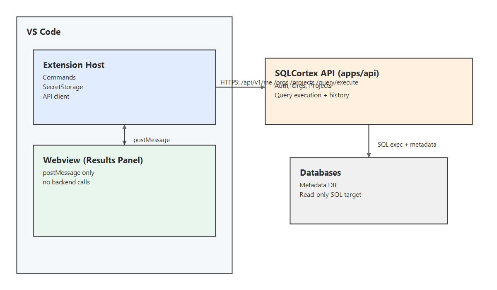

# Sprint 2 Overview (VS Code Extension)

## Scope
In scope:
- VS Code extension: login with API token, org/project selection, read-only SQL execution, results UI.
- Backend support for read-only query execution plus execution history attribution.
- Minimal web app support only if needed for auth/org/project/token management.

Out of scope:
- AI features (analysis/explain).
- Write queries or schema changes.
- Webview network access or token storage.

## Architecture


SVG source: [sqlcortex_vscode_architecture.svg](./diagrams/sqlcortex_vscode_architecture.svg)

## Extension constants
- API base URL (dev default): `http://localhost:3000`
- Required header: `X-SQLCortex-Client: vscode/<extensionVersion>`
- Auth: `Authorization: Bearer <token>`

## Backend API contracts (Sprint 2)
All errors use the standard envelope in `docs/contracts/contracts_api.md`.

Auth/session validation:
- `GET /api/v1/me` (Bearer token)

Org/project selection:
- `GET /api/v1/orgs`
- `GET /api/v1/projects` (filter by `org_id` client-side)

Query execution (new endpoint):
- `POST /api/v1/query/execute` (not implemented yet in `apps/api`; add in Phase 2.7)

Request:
```json
{
  "projectId": "uuid",
  "sql": "SELECT ...",
  "source": "vscode",
  "client": {
    "extensionVersion": "x.y.z",
    "vscodeVersion": "1.xx"
  }
}
```

Response:
```json
{
  "queryId": "uuid",
  "executionTimeMs": 23,
  "rowsReturned": 1,
  "columns": [{ "name": "?column?", "type": "int4" }],
  "rows": [[1]],
  "error": null
}
```

## Execution constraints (backend enforced)
- Timeout: 10s hard DB timeout per execution.
- Row limit: max 1000 rows returned.
- Read-only enforcement: SQL allowlist + read-only DB role; reject writes even if client bypassed.

## Done when (Sprint 2)
- [ ] Fresh install -> login -> select org/project -> run `SELECT 1` -> results render in VS Code.
- [ ] Invalid/expired token prompts re-login and blocks execution.
- [ ] Each execution is stored with user/org/project, `source=vscode`, and client versions.
- [ ] Webview never calls backend directly (no tokens in webview).
